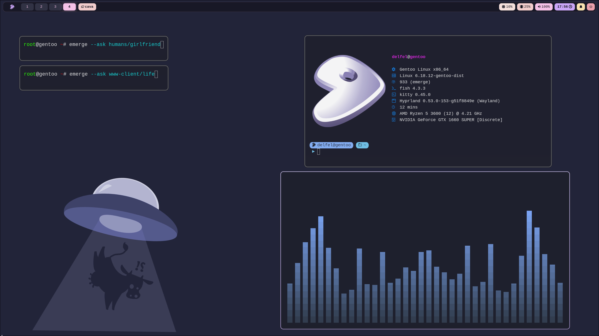

  

<h1 align="center">Dotfiles</h1>

### Description
Ive spent the last 6 days of my life configuring this crap.

Timeline of suffering:
- 1 day fighting with NVIDIA
- 1 day trial and error with Hyprland
- 1 day debugging pipewire
- 2 days gentoo-pilled straight
- 72 dependencies for a file manager
- My CPU has seen things
- Chromium compilation time...

But you know what?
- swww works (after building from source)
- The rice is fire
- And I can finally touch grass

Worth it? Probably not.
Would I do it again? Definitely yes.
